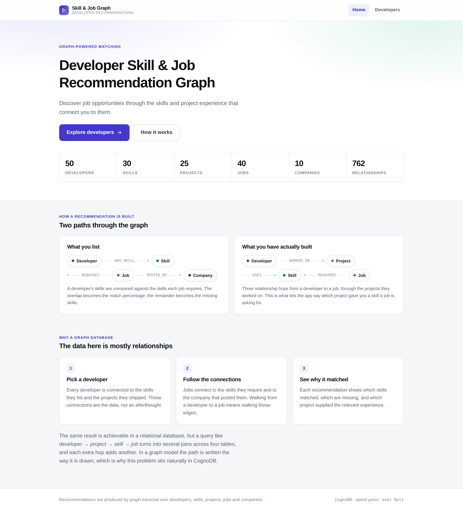
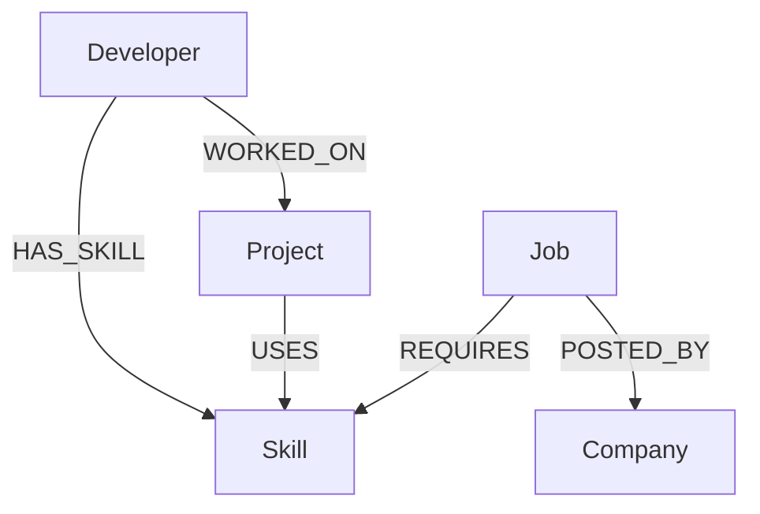
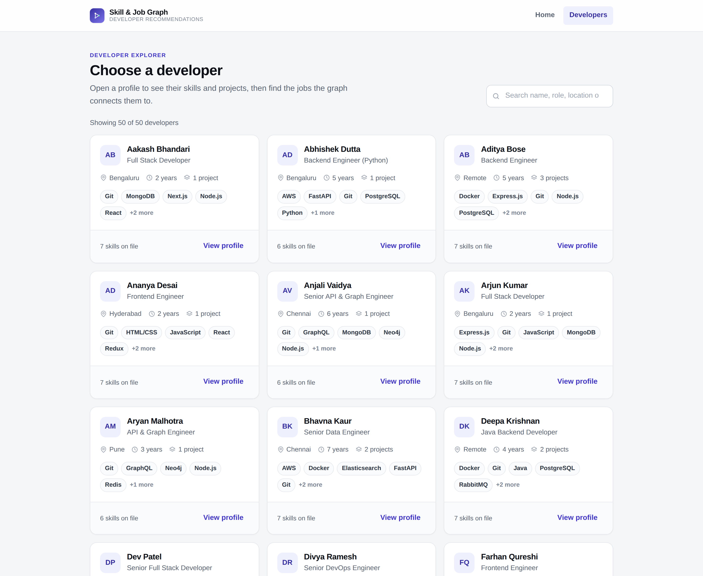
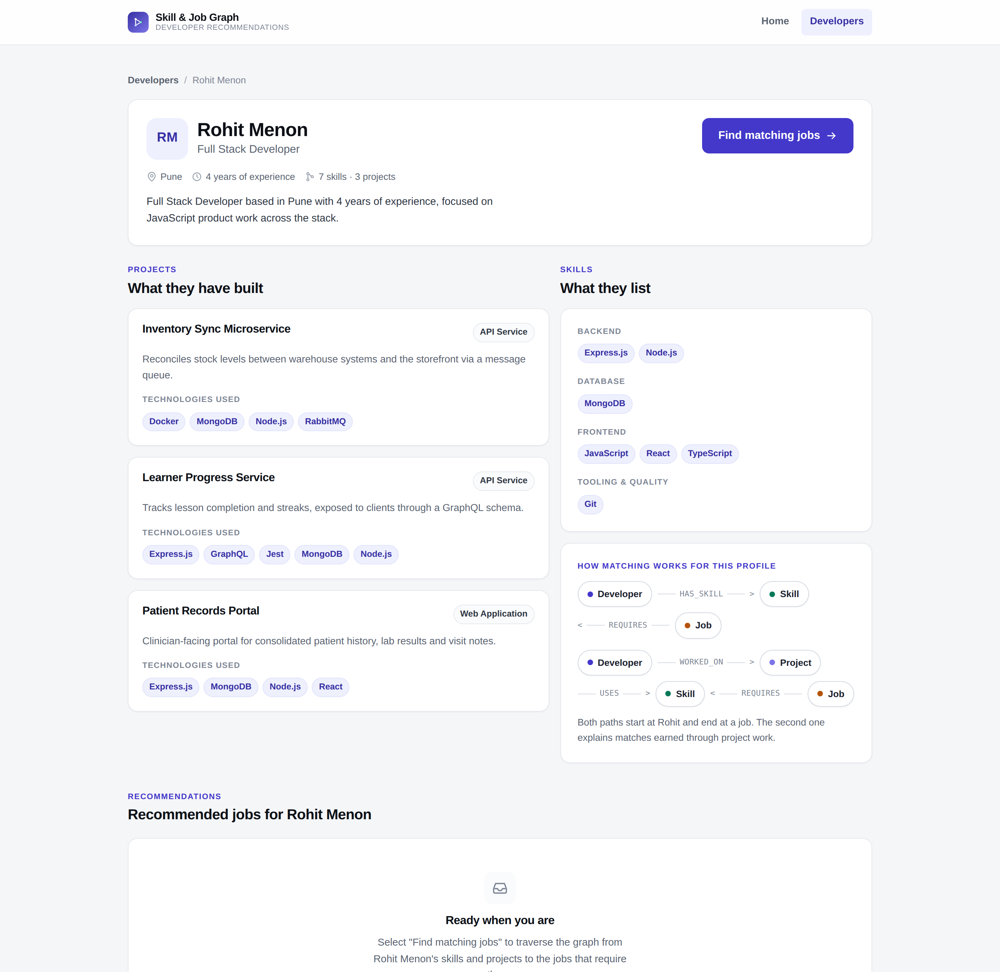
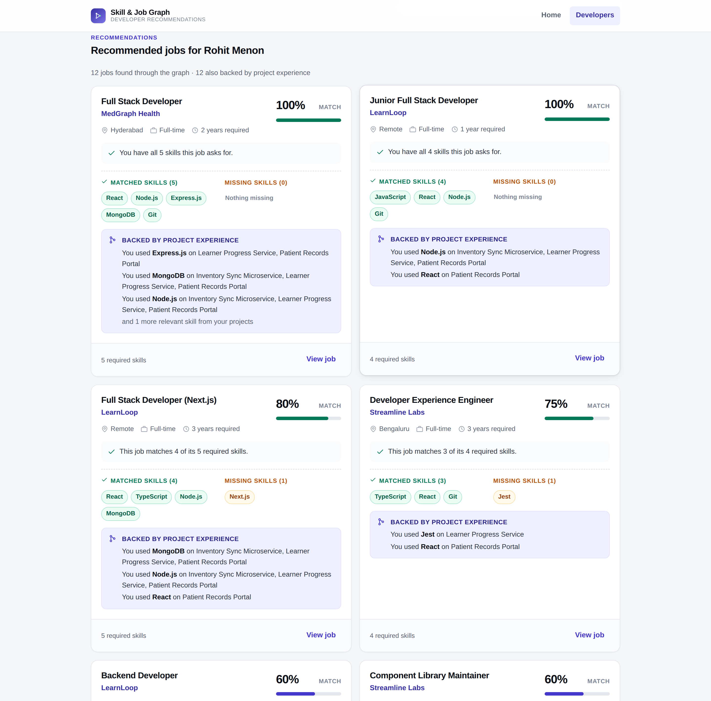
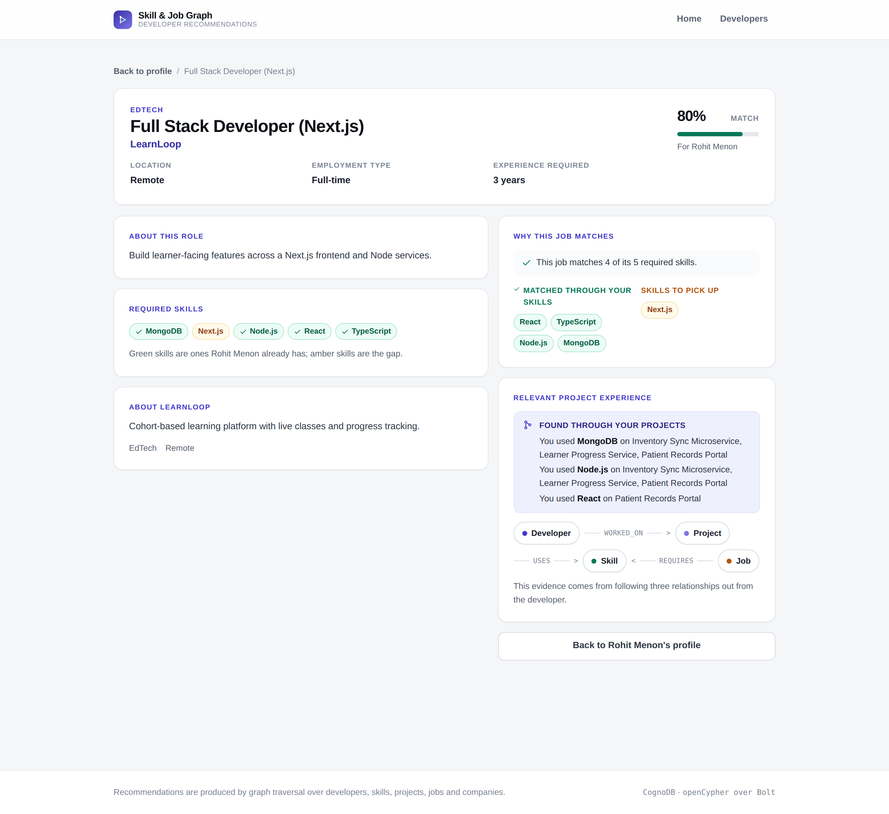
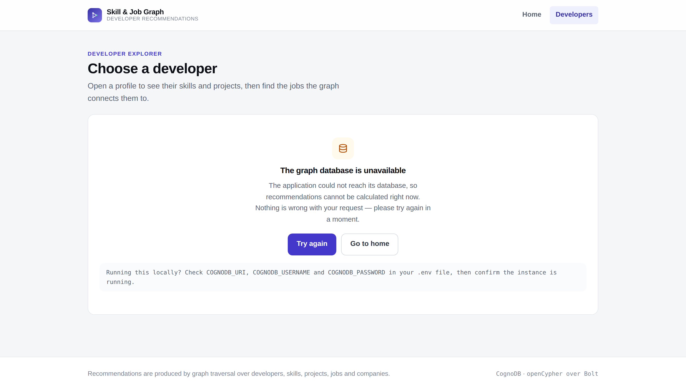
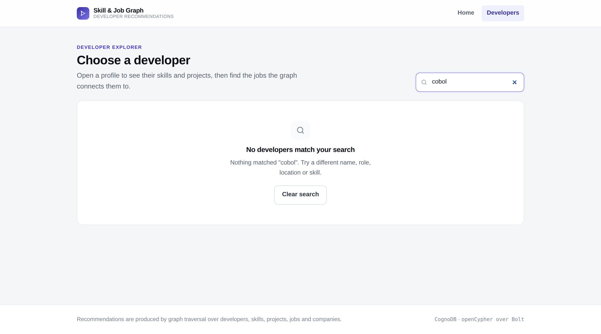
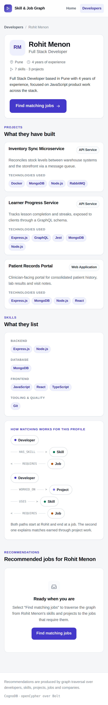

# Developer Skill & Job Recommendation Graph

A small full-stack application that recommends jobs to a developer by traversing a graph of
developers, skills, projects, jobs and companies stored in **CognoDB**, accessed over Bolt with the
official **Neo4j JavaScript driver**.

Every recommendation is explainable: the app shows which skills matched, which are missing, and
which project gave the developer the relevant experience.



---

## Table of contents

1. [Overview](#1-overview)
2. [Problem statement](#2-problem-statement)
3. [Why a graph database?](#3-why-a-graph-database)
4. [Technology stack](#4-technology-stack)
5. [Architecture](#5-architecture)
6. [Data model](#6-data-model)
7. [Main graph queries](#7-main-graph-queries)
8. [Why the multi-hop query matters](#8-why-the-multi-hop-query-matters)
9. [Setup](#9-setup)
10. [API documentation](#10-api-documentation)
11. [Screenshots](#11-screenshots)
12. [Deployment](#12-deployment)
13. [Project structure](#13-project-structure)
14. [Future improvements](#14-future-improvements)

---

## 1. Overview

The application answers one question well: **given a developer, which open jobs are worth their
attention, and why?**

The user journey is deliberately short:

```
Home  →  Developer explorer  →  Developer profile  →  Job recommendations  →  Job details
```

For a selected developer the app shows their listed skills and the projects they shipped, then
traverses the graph to find jobs that require those skills. Each recommended job is presented with:

- a **match percentage** — matched required skills ÷ total required skills
- the **matched skills** and the **missing skills**, visually distinguished
- **project evidence** — for example, *"You used Redis on the Multi-tenant Billing API"*

No machine learning, no black-box scoring. The intelligence is entirely in the graph traversal, and
every number on screen can be traced back to a Cypher statement in
[`backend/src/queries/cypherQueries.js`](backend/src/queries/cypherQueries.js).

---

## 2. Problem statement

Matching developers to jobs by keyword is unsatisfying for both sides:

- A developer's **listed skills** are an incomplete picture. Someone who shipped a payments ledger
  almost certainly worked with a message queue, whether or not "RabbitMQ" appears on their profile.
- A job's requirements are not a flat blob of text but a **set of specific skills**, each of which a
  candidate either has or does not.
- The interesting question — *"which of my projects makes me relevant to this role?"* — is a question
  about **paths between things**, not about rows in a table.

So the problem is inherently relationship-shaped: developers connect to skills and projects, projects
connect to skills, jobs connect to skills and companies. Answering "why does this job match me?"
means walking those connections and reporting what you walked through.

---

## 3. Why a graph database?

The dataset here is small (about 155 nodes) but densely connected (about 760 relationships). The
relationships *are* the information:

| Relationship | Meaning |
| --- | --- |
| `Developer -[:HAS_SKILL]-> Skill` | what the developer says they know |
| `Developer -[:WORKED_ON]-> Project` | what the developer actually built |
| `Project -[:USES]-> Skill` | which technologies a project involved |
| `Job -[:REQUIRES]-> Skill` | what a role needs |
| `Job -[:POSTED_BY]-> Company` | who is hiring |

Every question the product asks is a traversal:

- *Which jobs want what this developer knows?* → `Developer → Skill ← Job`
- *Which jobs relate to what this developer built?* → `Developer → Project → Skill ← Job`
- *Who is hiring for this?* → `Job → Company`

In Cypher, the second one is written almost exactly the way you would draw it on a whiteboard:

```cypher
MATCH (d:Developer {id: $developerId})-[:WORKED_ON]->(p:Project)-[:USES]->(s:Skill)
MATCH (s)<-[:REQUIRES]-(j:Job)-[:POSTED_BY]->(c:Company)
```

### An honest comparison with a relational model

A relational implementation of this is entirely possible, and for a dataset this size it would
perform fine. The difference is not capability, it is **fit**:

- The same traversal in SQL needs roughly five joins across `developers`, `developer_projects`,
  `project_skills`, `job_skills` and `jobs`, plus a join to `companies`. The query's shape stops
  resembling the question being asked.
- **Each additional hop adds another join table and another join.** Wanting to extend the path — say,
  *developer → project → skill → job → company → other jobs at that company* — means editing the
  join chain rather than adding one more arrow to a pattern.
- Returning the *evidence* ("which project supplied which skill") means carrying intermediate join
  columns through the aggregation. In Cypher the intermediate nodes are already bound as variables
  (`p`, `s`), so returning them is free.

The claim is not that SQL cannot do this. It is that a relationship-heavy, variable-depth,
path-oriented problem is more naturally and readably expressed as graph traversal — and this problem
is exactly that shape.

---

## 4. Technology stack

| Layer | Choice | Notes |
| --- | --- | --- |
| Frontend | React 19 + Vite 8 | JavaScript, no TypeScript, per the brief |
| Routing | React Router 7 | four routes |
| Styling | Hand-written CSS with custom properties | see the note below |
| Backend | Node.js 20+ / Express 4 | ES modules throughout |
| Driver | **`neo4j-driver` 5.x** | the official Neo4j JavaScript driver |
| Database | **CognoDB** | openCypher over Bolt (`bolt+s://`) |
| Security | `helmet`, `cors` | CSP, allow-listed CORS |
| Config | `dotenv` | credentials from environment only |
| Dev tooling | `concurrently`, `@neo4j-cypher/language-support` | see [Cypher validation](#cypher-validation) |

**Why plain CSS rather than Tailwind?** The app has five screens and a small, well-defined set of
surfaces. A single ~700-line stylesheet with design tokens gives full control over the visual
hierarchy with no extra build step or dependency, and the class names read as the design system they
are. Tailwind would not have been wrong — it just would not have earned its place here.

**Why the official Neo4j driver and not a CognoDB SDK?** CognoDB speaks openCypher over the Bolt
protocol, which is precisely what `neo4j-driver` implements. Using the official driver means standard
connection pooling, session management and retry semantics, and no bespoke protocol code to maintain.

---

## 5. Architecture

```
┌──────────────────────────┐
│  React 19 + Vite         │   Home · Developer explorer · Profile · Job detail
│  (browser)               │
└────────────┬─────────────┘
             │  HTTP  GET /api/...        (relative path — same origin in production)
             ▼
┌──────────────────────────┐
│  Express 4 API           │   routes → controllers → services → queries
│  (Node.js)               │   centralised error handling, helmet, CORS
└────────────┬─────────────┘
             │  Bolt  (neo4j-driver 5.x, bolt+s://)
             ▼
┌──────────────────────────┐
│  CognoDB                 │   openCypher graph database
└──────────────────────────┘
```

In production the Express process **also serves the built React bundle**, so the deployed application
has a single public URL and needs no CORS configuration at all. In development the Vite dev server
runs on `:5173` and proxies `/api` to `:5000`, so the frontend code always calls a relative `/api`
path and no API URL is ever compiled into the bundle.

**Request path for a recommendation:**

```
GET /api/developers/dev-003/recommendations
  → developerRoutes           validates the id format
  → developerController       reads req, writes res
  → recommendationService     runs 2 Cypher queries in parallel, merges the results
  → cypherQueries.js          parameterised Cypher
  → database.js               driver session (READ), always closed
  → CognoDB
```

---

## 6. Data model

Five node labels and five relationship types — no more.



### Node properties

| Label | Properties |
| --- | --- |
| **Developer** | `id`, `name`, `title`, `experienceYears`, `location`, `bio` |
| **Skill** | `id`, `name`, `category` |
| **Project** | `id`, `name`, `description`, `type` |
| **Job** | `id`, `title`, `description`, `location`, `experienceRequired`, `employmentType` |
| **Company** | `id`, `name`, `industry`, `location`, `description` |

### Relationship properties

Kept minimal — only where they carry real meaning:

| Relationship | Property | Purpose |
| --- | --- | --- |
| `HAS_SKILL` | `level` | `Advanced` / `Intermediate` / `Working knowledge` |
| `WORKED_ON` | `role` | `Contributor` / `Core Contributor` / `Tech Lead` |
| `REQUIRES` | `importance` | `Must have` / `Nice to have` |

### Seeded dataset

| Label | Count |
| --- | --- |
| Developer | 50 |
| Skill | 30 |
| Project | 25 |
| Job | 40 |
| Company | 10 |
| **Relationships** | **762** |

The dataset is deterministic — no randomness — so seeding twice produces an identical graph. It is
also constructed so the recommendation UI has something worth showing: every developer has at least
one strong match (≥ 70%) *and* at least one job with missing skills, and all 40 jobs are recommended
to somebody. See [`docs/data-model.md`](docs/data-model.md) for the design of the dataset in detail.

One deliberate choice: **a project's skills are not a subset of its developers' listed skills.** A
developer who shipped the Payments Ledger Service may never have listed RabbitMQ on their profile,
and surfacing exactly that is the point of the multi-hop query.

---

## 7. Main graph queries

All Cypher lives in one place — [`backend/src/queries/`](backend/src/queries/) — and every statement
is parameterised. There is no string-built Cypher anywhere in the project.

### Query 1 — Developer explorer list

```cypher
MATCH (d:Developer)
OPTIONAL MATCH (d)-[:HAS_SKILL]->(s:Skill)
OPTIONAL MATCH (d)-[:WORKED_ON]->(p:Project)
WITH d,
     collect(DISTINCT s.name) AS skills,
     count(DISTINCT p) AS projectCount
WITH d, skills, projectCount
  ORDER BY d.name ASC
RETURN d AS developer, skills, projectCount
```

`OPTIONAL MATCH` means a developer with no skills or no projects still appears in the list (with
empty collections) rather than silently vanishing.

### Query 2 — Developer profile

```cypher
MATCH (d:Developer {id: $developerId})
OPTIONAL MATCH (d)-[:HAS_SKILL]->(s:Skill)
OPTIONAL MATCH (d)-[:WORKED_ON]->(p:Project)
RETURN d AS developer,
       collect(DISTINCT s) AS skills,
       collect(DISTINCT p) AS projects
```

### Query 3 — Main recommendation query (`Developer → Skill ← Job`)

This is the query behind the recommendation list.

```cypher
MATCH (d:Developer {id: $developerId})-[:HAS_SKILL]->(ds:Skill)
WITH collect(DISTINCT ds.name) AS developerSkills

MATCH (j:Job)-[:REQUIRES]->(rs:Skill)
WITH developerSkills, j, collect(DISTINCT rs.name) AS requiredSkills

WITH j,
     requiredSkills,
     [name IN requiredSkills WHERE name IN developerSkills]     AS matchedSkills,
     [name IN requiredSkills WHERE NOT name IN developerSkills] AS missingSkills

MATCH (j)-[:POSTED_BY]->(c:Company)
WITH j, c, requiredSkills, matchedSkills, missingSkills,
     CASE
       WHEN size(requiredSkills) = 0 THEN 0.0
       ELSE toFloat(size(matchedSkills)) / toFloat(size(requiredSkills)) * 100.0
     END AS matchPercentage
WHERE size(matchedSkills) > 0

RETURN j AS job, c AS company,
       requiredSkills, matchedSkills, missingSkills, matchPercentage
  ORDER BY matchPercentage DESC, size(matchedSkills) DESC, j.title ASC
  LIMIT $limit
```

Step by step:

1. **Collect the developer's skill names** into one list. The aggregation has no grouping key, so it
   yields exactly one row — an empty list if the developer has no skills at all.
2. **For every job, collect its required skill names.**
3. **Split the required list** into matched and missing with two list comprehensions.
4. **Join to the company** that posted the job.
5. **Compute the percentage**: `matched / required × 100`, guarded against division by zero.
6. **Drop zero-overlap jobs** — a 0% row is noise, not a recommendation.
7. **Rank** by percentage, then by absolute matched count so a 4-of-5 match outranks a 1-of-1 at
   equal percentage, then by title for a stable order.

`$limit` is bound as a Bolt Integer via `asInteger()` in `database.js` — a plain JavaScript number
is transmitted as a Float, and Cypher rejects a Float in a `LIMIT` clause.

### Query 4 — **The multi-hop query** (`Developer → Project → Skill ← Job`)

**This is the required multi-hop traversal.** Four relationship hops in a single pattern.

```cypher
MATCH (d:Developer {id: $developerId})-[:WORKED_ON]->(p:Project)-[:USES]->(s:Skill)
MATCH (s)<-[:REQUIRES]-(j:Job)-[:POSTED_BY]->(c:Company)
WITH j, c, s.name AS skillName, collect(DISTINCT p.name) AS projectNames
RETURN j AS job, c AS company, skillName, projectNames
  ORDER BY j.title ASC, skillName ASC
```

It starts from one developer, walks to the projects they worked on, then to the skills those projects
used, then back to the jobs requiring those skills, and finally to the hiring company. It returns not
just the jobs but **which project supplied which skill** — the evidence the UI renders as
*"You used MongoDB on Inventory Sync Microservice, Learner Progress Service"*.

Rows come back flat (one per job + skill) and are grouped by job in `recommendationService.js`. That
avoids nested map literals and keeps the statement portable across openCypher engines.

### Query 5 — Job detail

```cypher
MATCH (j:Job {id: $jobId})
OPTIONAL MATCH (j)-[:POSTED_BY]->(c:Company)
OPTIONAL MATCH (j)-[:REQUIRES]->(s:Skill)
WITH j, c, collect(DISTINCT s) AS requiredSkills
RETURN j AS job, c AS company, requiredSkills
```

The job detail page additionally runs Query 3's logic and the multi-hop query narrowed to a single
job, to render the "Why this job matches" panel — see `GET_JOB_MATCH_FOR_DEVELOPER` and
`GET_PROJECT_EVIDENCE_FOR_JOB`.

### Query 6 — Live graph statistics

Powers the counts on the home page, so the landing page reports the real contents of the database
rather than hardcoded numbers.

### Parameterisation

Every value that could originate from a user is passed as a parameter:

```js
// backend/src/services/recommendationService.js
runReadQuery(GET_JOB_RECOMMENDATIONS, { developerId, limit: asInteger(limit) });
```

```cypher
MATCH (d:Developer {id: $developerId})   -- never  {id: '...' + input}
```

Cypher injection is therefore not possible: values are sent to the database separately from the query
text and are never parsed as Cypher. Route parameters are additionally format-checked
(`/^[A-Za-z0-9_-]{1,64}$/`) so an obviously malformed id becomes a cheap `400` instead of a database
round trip.

### Cypher validation

Because a syntax error in Cypher only surfaces at runtime, the project includes an offline check that
parses every statement against the official Cypher grammar:

```bash
npm run check:cypher
```

```
Validating 28 Cypher statements

  PASS  GET_DEVELOPERS
  PASS  GET_DEVELOPER_PROFILE (params: developerId)
  PASS  GET_JOB_RECOMMENDATIONS (params: developerId, limit)
  PASS  GET_PROJECT_BASED_RECOMMENDATIONS (params: developerId)
  ...
All Cypher statements parsed cleanly and use parameters only.
```

It also fails the build if any query string contains an interpolation (`${`), which enforces the
parameterisation rule mechanically rather than by convention.

---

## 8. Why the multi-hop query matters

```
Developer  ──WORKED_ON──▶  Project  ──USES──▶  Skill  ◀──REQUIRES──  Job
```

A developer's profile is a claim; their project history is evidence. The multi-hop traversal uses the
second to explain the first.

Concretely, on the job detail page for *Full Stack Developer (Next.js)* the app can say:

> **Found through your projects**
> You used MongoDB on Inventory Sync Microservice, Learner Progress Service
> You used Node.js on Inventory Sync Microservice, Learner Progress Service, Patient Records Portal
> You used React on Patient Records Portal

That sentence requires knowing the *whole path*, not just its endpoints — which project, which skill,
which job. In the graph model the intermediate nodes are already bound as variables (`p`, `s`) by the
pattern, so returning them costs nothing extra.

**This is also the query that would be most awkward relationally.** The equivalent SQL joins
`developers → developer_projects → projects → project_skills → skills → job_skills → jobs →
companies` — five join tables to express one sentence — and to keep the evidence you must carry
`projects.name` and `skills.name` through the grouping rather than simply returning bound variables.
Again: possible, but the query stops looking like the question.

---

## 9. Setup

### Prerequisites

- **Node.js 20 or newer** and npm 10+ (`node --version`)
- A **CognoDB instance** and its Bolt credentials

### Step 1 — Create a CognoDB instance

Create an instance in CognoDB and note three values from its connection details:

- the **Bolt URI**, of the form `bolt+s://<instance-id>.databases.cognodb.cloud`
  (use `bolt+s://` — the `+s` enables TLS, which hosted instances require)
- the **username** (typically `cognodb`)
- the **password**, shown once at creation time

> Keep these out of source control, chat messages and screenshots. They belong only in your local
> `.env` file and in your hosting platform's secret store.

### Step 2 — Clone and install

```bash
git clone <your-repository-url>
cd developer-skill-job-graph

# installs root, backend and frontend dependencies
npm run install:all
```

### Step 3 — Configure environment variables

```bash
cp .env.example .env
```

Then edit `.env`:

```ini
COGNODB_URI=bolt+s://your-instance-id.databases.cognodb.cloud
COGNODB_USERNAME=cognodb
COGNODB_PASSWORD=your-password-here
COGNODB_DATABASE=

PORT=5000
NODE_ENV=development
CORS_ORIGIN=http://localhost:5173
```

`.env` is listed in `.gitignore` and must never be committed. `.env.example` contains placeholders
only.

| Variable | Required | Purpose |
| --- | --- | --- |
| `COGNODB_URI` | yes | Bolt connection URI |
| `COGNODB_USERNAME` | yes | database user |
| `COGNODB_PASSWORD` | yes | database password |
| `COGNODB_DATABASE` | no | target database; blank uses the instance default |
| `PORT` | no | API port, default `5000` |
| `NODE_ENV` | no | `development` or `production` |
| `CORS_ORIGIN` | no | comma-separated allowed origins; unnecessary in single-origin production |
| `VITE_API_BASE_URL` | no | only for a split frontend/backend deployment |

### Step 4 — Seed the database

```bash
npm run seed
```

Expected output:

```
Connecting to CognoDB...
  ✓ Connected to bolt+s://<host> (Bolt 5.x)

Applying uniqueness constraints (best effort)
  ✓ 5 constraints in place

Writing nodes (target: 50 developers, 30 skills, 25 projects, 40 jobs, 10 companies)
  ✓ Skill: 30
  ✓ Company: 10
  ✓ Project: 25
  ✓ Developer: 50
  ✓ Job: 40

Writing relationships (target: 762)
  ✓ HAS_SKILL: 344
  ✓ WORKED_ON: 89
  ✓ USES: 111
  ✓ REQUIRES: 178
  ✓ POSTED_BY: 40

Graph contents (read back from the database)
  ...
Seed complete.
```

The seed is **idempotent** — every write is a `MERGE` keyed on the business `id`, so running it twice
updates the existing graph rather than duplicating it. To start from a clean slate:

```bash
npm run seed -- --reset     # deletes only the five labels this app owns
```

### Step 5 — Verify the graph

```bash
npm run verify:db
```

This runs the real service layer against your instance and prints what came back — connection status,
node and relationship counts, a developer profile, the top matches with their percentages, and the
multi-hop evidence — then asserts a set of invariants (matched + missing = required, ranking is
descending, an unknown id returns 404). It exits non-zero if anything fails, so it is a definitive
"is this working?" check before recording a demo.

### Step 6 — Run the app

Development (two processes, hot reload):

```bash
npm run dev
```

- frontend → <http://localhost:5173>
- API → <http://localhost:5000/api/health>

Production-style (one process, one URL):

```bash
npm run build     # builds the React bundle into frontend/dist
npm start         # Express serves the API and the bundle on PORT
```

### Available scripts

| Command | Runs from | Purpose |
| --- | --- | --- |
| `npm run install:all` | root | install root + backend + frontend dependencies |
| `npm run dev` | root | Vite dev server and API together |
| `npm run seed` | root | seed CognoDB (add `-- --reset` to wipe first) |
| `npm run verify:db` | root | end-to-end check against the live database |
| `npm run check:cypher` | root | parse all Cypher offline, no database needed |
| `npm run build` | root | build the React production bundle |
| `npm start` | root | start the API, serving the bundle if it exists |

---

## 10. API documentation

Base path: `/api`. All endpoints are `GET`. Successful responses are
`{ "success": true, "data": { ... } }`; failures are
`{ "success": false, "message": "...", "code": "..." }`.

### `GET /api/health`

Liveness plus database reachability. Returns `200` when connected, `503` when not — so both uptime
checks and the UI can react to an outage.

```json
{
  "status": "ok",
  "database": "connected",
  "target": "bolt+s://your-instance.databases.cognodb.cloud",
  "protocolVersion": "5.4",
  "environment": "production",
  "uptimeSeconds": 412
}
```

`target` is the host only — credentials are never included in any response.

### `GET /api/stats`

Live node and relationship counts, used by the home page.

```json
{ "success": true,
  "data": { "developers": 50, "skills": 30, "projects": 25, "jobs": 40,
            "companies": 10, "relationships": 762, "seeded": true } }
```

### `GET /api/developers`

All developers with their skill names and project counts, for the explorer grid.

```json
{ "success": true,
  "data": { "total": 50,
            "developers": [
              { "id": "dev-003", "name": "Rohit Menon", "title": "Full Stack Developer",
                "experienceYears": 4, "location": "Pune",
                "bio": "…", "skills": ["Express.js", "Git", "…"], "projectCount": 3 }
            ] } }
```

### `GET /api/developers/:id`

One developer with skills and projects. Each project carries the technologies it used, from the
2-hop `Developer → Project → Skill` traversal.

```json
{ "success": true,
  "data": {
    "developer": { "id": "dev-003", "name": "Rohit Menon", "…": "…" },
    "skills":   [{ "id": "skill-001", "name": "React", "category": "Frontend" }],
    "projects": [{ "id": "project-003", "name": "Patient Records Portal",
                   "type": "Web Application", "description": "…",
                   "skills": ["Express.js", "MongoDB", "Node.js", "React"] }]
  } }
```

`404 DEVELOPER_NOT_FOUND` for an unknown id, `400 INVALID_ID` for a malformed one.

### `GET /api/developers/:id/recommendations`

**The main endpoint.** Ranked jobs with match breakdown and project evidence.

| Query param | Default | Notes |
| --- | --- | --- |
| `limit` | `12` | clamped to 1–40 |

```json
{ "success": true,
  "data": {
    "developer": { "id": "dev-003", "name": "Rohit Menon", "…": "…" },
    "recommendations": [
      {
        "job":     { "id": "job-009", "title": "Full Stack Developer",
                     "location": "Hyderabad", "employmentType": "Full-time",
                     "experienceRequired": 2, "description": "…" },
        "company": { "id": "company-003", "name": "MedGraph Health",
                     "industry": "Healthtech", "location": "Hyderabad", "description": "…" },
        "requiredSkills": ["React", "Node.js", "Express.js", "MongoDB", "Git"],
        "matchedSkills":  ["React", "Node.js", "Express.js", "MongoDB", "Git"],
        "missingSkills":  [],
        "matchPercentage": 100,
        "projectEvidence": [
          { "skill": "Express.js",
            "projects": ["Learner Progress Service", "Patient Records Portal"] }
        ]
      }
    ],
    "meta": { "limit": 12, "returned": 12, "withProjectEvidence": 12 }
  } }
```

### `GET /api/jobs/:id`

Job detail. Pass `?developerId=dev-003` to also receive the match breakdown and the multi-hop project
evidence for that developer; omit it and `match` is `null` and `projectEvidence` is empty.

```json
{ "success": true,
  "data": {
    "job": { "id": "job-033", "title": "Full Stack Developer (Next.js)", "…": "…" },
    "company": { "id": "company-009", "name": "LearnLoop", "…": "…" },
    "requiredSkills": [{ "id": "skill-002", "name": "Next.js", "category": "Frontend" }],
    "match": { "developerName": "Rohit Menon",
               "requiredSkills": ["Next.js", "React", "TypeScript", "Node.js", "MongoDB"],
               "matchedSkills":  ["React", "TypeScript", "Node.js", "MongoDB"],
               "missingSkills":  ["Next.js"],
               "matchPercentage": 80 },
    "projectEvidence": [{ "skill": "MongoDB", "projects": ["Inventory Sync Microservice"] }]
  } }
```

### `GET /api/companies/:id`

A company and the jobs it has posted.

### Error responses

| Status | `code` | When |
| --- | --- | --- |
| `400` | `INVALID_ID` | id fails the format check |
| `404` | `DEVELOPER_NOT_FOUND` / `JOB_NOT_FOUND` / `COMPANY_NOT_FOUND` | no such node |
| `404` | `ROUTE_NOT_FOUND` | unknown `/api` path |
| `503` | `DATABASE_UNAVAILABLE` | CognoDB unreachable |
| `503` | `DATABASE_UNAUTHORIZED` | credentials rejected |
| `503` | `DATABASE_NOT_CONFIGURED` | required env vars missing |
| `500` | `INTERNAL_ERROR` | unexpected fault — details logged server-side only |

Driver errors are translated into these codes in `database.js`; raw messages, stack traces and
connection strings are never sent to a client.

---

## 11. Screenshots

> These were captured against the seeded dataset. If you re-seed and re-deploy, they remain accurate
> because the seed is deterministic. See [`docs/screenshot-guide.md`](docs/screenshot-guide.md) to
> re-capture them against your own live deployment.

### Home


### Developer explorer



### Developer profile



### Job recommendations

Match percentage, matched vs. missing skills, and the project evidence from the multi-hop traversal.



### Job details



### Database unavailable

The app degrades to a clear, actionable message instead of an error page or a stack trace.



### Empty state



### Responsive layout



---

## 12. Deployment

The recommended shape is **one service, one URL**: Express serves both the API and the built React
bundle. This removes CORS from the equation entirely and halves the deployment surface.

### Render (single web service)

[`render.yaml`](render.yaml) is included, so the repository can be deployed as a Blueprint. Manually,
the settings are:

| Setting | Value |
| --- | --- |
| Environment | Node |
| Build command | `npm install && npm run render:build` |
| Start command | `npm start` |
| Health check path | `/api/health` |

Then add the environment variables in the Render dashboard (**never** in the repository):

```
COGNODB_URI       = bolt+s://<instance-id>.databases.cognodb.cloud
COGNODB_USERNAME  = cognodb
COGNODB_PASSWORD  = <your password>
NODE_ENV          = production
```

`PORT` is injected by Render automatically. `CORS_ORIGIN` is not needed — the frontend is served from
the same origin. `COGNODB_DATABASE` is optional.

### Railway / Fly.io

The same three commands apply: install, `npm run render:build`, `npm start`. Set the same environment
variables in the platform's secret store and point the health check at `/api/health`.

### Split deployment (frontend and backend separately)

If you prefer a CDN-hosted frontend:

1. Deploy the backend as above.
2. Build the frontend with `VITE_API_BASE_URL=https://<your-backend>/api`.
3. Set `CORS_ORIGIN=https://<your-frontend-domain>` on the backend.

This works, but it adds a CORS surface and a second deploy for no functional gain here.

### Post-deployment checklist

```bash
curl https://<your-app>/api/health          # expect {"status":"ok","database":"connected"}
curl https://<your-app>/api/stats           # expect the seeded counts
```

Then walk the full journey in a browser: home → developers → a profile → find matching jobs → view a
job. Confirm the match percentages and project evidence render, and that a hard refresh on
`/developers/dev-003` still works (the SPA fallback is configured).

Keep the CognoDB instance running after submission — hosted instances are sometimes paused when idle,
which would make the live demo show the "database unavailable" state.

---

## 13. Project structure

```
developer-skill-job-graph/
│
├── backend/
│   ├── src/
│   │   ├── config/
│   │   │   ├── database.js          driver, sessions, connectivity check, shutdown
│   │   │   └── env.js               env loading, validation, safe target string
│   │   ├── controllers/             HTTP in, HTTP out — no graph logic
│   │   │   ├── developerController.js
│   │   │   ├── jobController.js
│   │   │   └── systemController.js  health + stats
│   │   ├── middleware/
│   │   │   ├── asyncHandler.js      async errors reach the error middleware
│   │   │   ├── errorHandler.js      one JSON error shape, nothing leaked
│   │   │   └── validateId.js        id format check
│   │   ├── queries/
│   │   │   ├── cypherQueries.js     ALL read Cypher, parameterised
│   │   │   └── seedQueries.js       ALL write Cypher for the seed
│   │   ├── routes/                  route tables only
│   │   ├── services/                graph queries + result shaping
│   │   │   ├── developerService.js
│   │   │   ├── recommendationService.js
│   │   │   ├── jobService.js
│   │   │   └── graphService.js
│   │   ├── utils/
│   │   │   ├── ApiError.js          status + safe message
│   │   │   └── graphMapper.js       driver values → plain objects
│   │   ├── app.js                   Express wiring, static bundle, security
│   │   └── server.js                listen, boot diagnostics, graceful shutdown
│   └── scripts/
│       ├── seedData.js              the deterministic dataset
│       ├── seedDatabase.js          npm run seed
│       ├── verifyDatabase.js        npm run verify:db
│       └── validateCypher.js        npm run check:cypher
│
├── frontend/
│   ├── src/
│   │   ├── components/              Layout, cards, MatchMeter, GraphPath, state views, icons
│   │   ├── pages/                   Home, Developers, DeveloperProfile, JobDetail, NotFound
│   │   ├── services/api.js          the only place that calls the API
│   │   ├── hooks/useApiResource.js  loading / error / data / retry
│   │   ├── utils/format.js          display helpers
│   │   ├── styles/global.css        design tokens and component styles
│   │   ├── App.jsx                  routes
│   │   └── main.jsx                 entry, router, error boundary
│   └── public/graph.svg
│
├── docs/
│   ├── data-model.md                dataset and modelling decisions
│   ├── screenshot-guide.md          how to re-capture the README images
│   └── screenshots/
│
├── .env.example                     placeholders only
├── .gitignore                       ignores .env
├── render.yaml                      single-service deployment
└── package.json                     root scripts
```

### Design notes worth defending

- **Cypher is centralised.** Every statement lives in `src/queries/`. Services import constants; no
  query text is scattered through the codebase.
- **Nodes are returned whole, not map-projected.** Map projections (`d { .* }`) are a vendor
  extension. Returning nodes and unwrapping them in one mapper (`graphMapper.js`) keeps the Cypher
  portable across openCypher engines.
- **The server starts even when the database is down.** A database outage should surface as a `503`
  and a friendly UI state, not as a crash loop on the hosting platform.
- **`disableLosslessIntegers: true`** on the driver — every integer in this domain is a small count,
  so plain JS numbers keep the service layer free of `neo4j.Integer` handling. The one place that
  needs a real Bolt Integer (`LIMIT $limit`) uses the explicit `asInteger()` helper.
- **Client-side search on the explorer.** 50 developers arrive in one request; instant local
  filtering beats a request per keystroke. At a larger scale this belongs in the Cypher.

---

## 14. Future improvements

- Move explorer filtering into Cypher once the dataset outgrows a single response.
- Weight the match by the `importance` property already stored on `REQUIRES`, so a missing
  *Must have* counts differently from a missing *Nice to have*.
- Surface "developers similar to this one" via shared skills — a natural next traversal
  (`Developer → Skill ← Developer`).
- Add an automated test suite around the service layer.

---

## Licence

Prepared as a take-home assignment submission.
