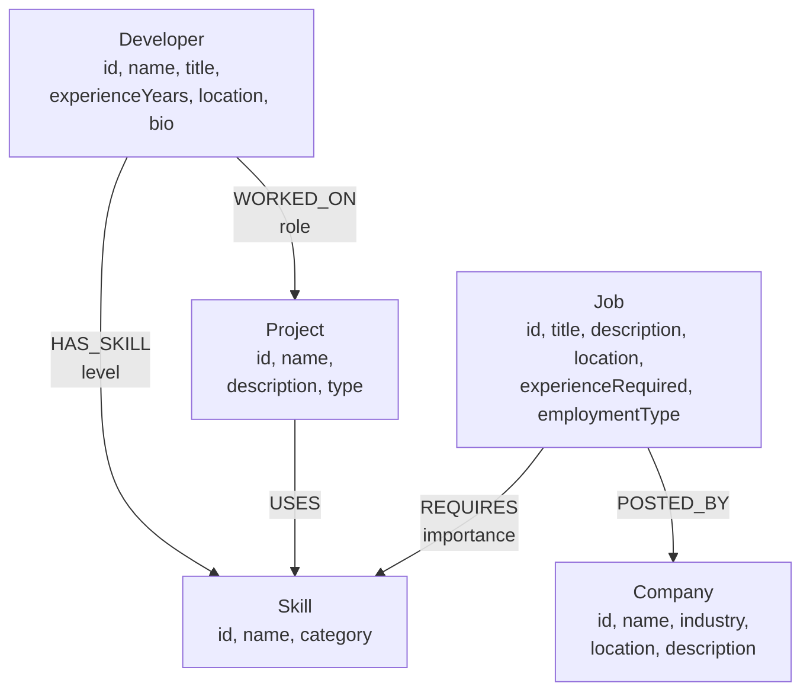

# Data model and dataset design

Supplementary detail behind the model summarised in the [README](../README.md#6-data-model).

---

## 1. The graph



`Skill` is the hub of the model. Developers, projects and jobs all connect to it, which is what makes
a single node type the meeting point for three different questions:

- what a developer *claims* (`HAS_SKILL`)
- what a developer *demonstrated* (`WORKED_ON` → `USES`)
- what a job *needs* (`REQUIRES`)

### Why exactly five labels

The brief specified five, and the model does not want more. Two temptations were resisted:

- **A `SkillCategory` node.** Category is a single string with no relationships of its own, so it is a
  property on `Skill`, not a node.
- **A `Location` node.** Nothing traverses through location in this application; it is display data on
  three labels.

Adding either would grow the model without enabling a query the product actually asks.

### Why relationship properties are sparse

Three relationships carry one property each, and only where it means something:

| Relationship | Property | Values | Why it exists |
| --- | --- | --- | --- |
| `HAS_SKILL` | `level` | `Advanced`, `Intermediate`, `Working knowledge` | shows a skill is a graded claim, not a boolean |
| `WORKED_ON` | `role` | `Contributor`, `Core Contributor`, `Tech Lead` | contribution depth differs per project |
| `REQUIRES` | `importance` | `Must have`, `Nice to have` | not every required skill is equally required |

`USES` and `POSTED_BY` are unqualified facts and carry nothing.

`importance` is stored but **not** used in the match percentage. Weighting by it would make the
percentage less transparent, and the brief is explicit that the formula should be obvious. It is
modelled because it is true of the domain, and it is the most natural next step if the scoring were
ever to become weighted.

---

## 2. Identifiers

Every node has a human-readable business `id`:

```
dev-001 … dev-050          skill-001 … skill-030      project-001 … project-025
job-001 … job-040          company-001 … company-010
```

These are the MERGE keys, which is what makes the seed idempotent. Internal database ids are never
exposed through the API or used in URLs — the app's URLs (`/developers/dev-003`) are stable across
re-seeds and across instances.

---

## 3. Dataset composition

| Label | Count | Notes |
| --- | --- | --- |
| Developer | 50 | 10 stack archetypes × 5 variants |
| Skill | 30 | across 6 categories |
| Project | 25 | 3–5 skills each |
| Job | 40 | 4 per company, 3–6 required skills each |
| Company | 10 | distinct industries and locations |

| Relationship | Count |
| --- | --- |
| `HAS_SKILL` | 344 |
| `WORKED_ON` | 89 |
| `USES` | 111 |
| `REQUIRES` | 178 |
| `POSTED_BY` | 40 |
| **Total** | **762** |

### Skill categories

| Category | Skills |
| --- | --- |
| Frontend | React, Next.js, TypeScript, JavaScript, Tailwind CSS, Redux, HTML/CSS |
| Backend | Node.js, Express.js, Java, Spring Boot, Python, Django, FastAPI, REST APIs |
| API & Messaging | GraphQL, RabbitMQ |
| Database | PostgreSQL, MongoDB, MySQL, Redis, Neo4j, Elasticsearch |
| Cloud & DevOps | Docker, Kubernetes, AWS, CI/CD, Terraform |
| Tooling & Quality | Git, Jest |

### Developer archetypes

Developers are generated from ten realistic stack profiles, each with five variants that differ in
seniority, location and one or two extra skills:

| Archetype | Core skills |
| --- | --- |
| Full Stack (MERN) | React, JavaScript, Node.js, Express.js, MongoDB, Git |
| Frontend Engineer | React, TypeScript, JavaScript, HTML/CSS, Tailwind CSS, Git |
| Backend Engineer (Node) | Node.js, Express.js, TypeScript, PostgreSQL, REST APIs, Git |
| Java Backend Developer | Java, Spring Boot, PostgreSQL, REST APIs, Git |
| Backend Engineer (Python) | Python, FastAPI, PostgreSQL, REST APIs, Git |
| Python Developer (Django) | Python, Django, PostgreSQL, Git |
| DevOps Engineer | Docker, Kubernetes, AWS, CI/CD, Git |
| Full Stack (Next.js) | Next.js, React, TypeScript, Node.js, Tailwind CSS, Git |
| Data Engineer | Python, PostgreSQL, Elasticsearch, Docker, Git |
| API & Graph Engineer | Node.js, GraphQL, Neo4j, TypeScript, Git |

Each developer is assigned 1–3 projects from a pool consistent with their archetype. Experience runs
from 1 to 7 years, which drives the title prefix (`Junior` under 2 years, `Senior` at 6+) and means
different developers clear the bar for different roles.

---

## 4. Why the data is built this way

Seed data is easy to get wrong in two opposite directions: too random and the recommendations become
nonsense; too neat and every match is 100% and the UI has nothing to show. Three rules keep it
useful.

### Rule 1 — Determinism

No `Math.random()` anywhere. The dataset is explicit records plus index arithmetic, so:

- re-seeding produces a byte-identical graph
- the README screenshots stay accurate
- a bug is reproducible rather than intermittent

### Rule 2 — Project skills are *not* a subset of developer skills

This is the most important modelling decision in the dataset, and it is deliberate.

Rohit Menon (`dev-003`) lists React, JavaScript, Node.js, Express.js, MongoDB, TypeScript and Git.
One of his projects, *Inventory Sync Microservice*, uses Docker, MongoDB, Node.js and RabbitMQ — so he
has hands-on Docker and RabbitMQ exposure that his profile never mentions.

If project skills merely mirrored profile skills, the multi-hop query
`Developer → Project → Skill ← Job` would return nothing the direct query
`Developer → Skill ← Job` had not already found, and the multi-hop traversal would be decoration. The
gap is what gives it a job to do.

### Rule 3 — Verified match distribution

The dataset is checked, not assumed. Running the recommendation for all 50 developers gives:

| Match band | Recommendations |
| --- | --- |
| 100% | 98 |
| 70–99% | 157 |
| 40–69% | 452 |
| 1–39% | 594 |

And these hold for **every** developer:

- at least one strong match (≥ 70%) — so no profile looks broken
- at least one job with missing skills — so the "missing skills" UI always has something to show
- at least one job backed by project evidence — so the multi-hop panel is never empty

All 40 jobs are recommended to at least one developer, so no seeded job is dead weight.

`npm run verify:db` re-checks the arithmetic invariants against your live instance:

- `matched + missing = required` for every recommendation
- matched and missing sets are disjoint
- the percentage equals `matched / required × 100`
- results are ordered by descending percentage

---

## 5. Idempotency

Every write in `seedQueries.js` is a `MERGE` on the business `id`, batched through `UNWIND`:

```cypher
UNWIND $rows AS row
MERGE (s:Skill {id: row.id})
SET s.name = row.name,
    s.category = row.category
```

Relationships follow the same pattern — `MATCH` both endpoints by `id`, then `MERGE` the edge:

```cypher
UNWIND $rows AS row
MATCH (d:Developer {id: row.developerId})
MATCH (s:Skill {id: row.skillId})
MERGE (d)-[rel:HAS_SKILL]->(s)
SET rel.level = row.level
```

So `npm run seed` twice yields 50 developers, not 100.

Uniqueness constraints on each label's `id` are applied on a **best-effort** basis. Constraint DDL is
not part of core openCypher, so if the engine rejects it the seed logs a note and continues — the
MERGE statements are correct either way, and constraints only make them faster and add a safety net.

`npm run seed -- --reset` deletes only the five labels this application owns:

```cypher
MATCH (n)
WHERE n:Developer OR n:Skill OR n:Project OR n:Job OR n:Company
DETACH DELETE n
```

This means the app can share an instance with unrelated data without a reset destroying it.

---

## 6. Portability notes

The Cypher deliberately stays inside constructs that any openCypher engine supports:

| Avoided | Why | Used instead |
| --- | --- | --- |
| APOC / vendor procedures | not portable | plain Cypher |
| Map projections (`d { .* }`) | Neo4j extension | return whole nodes, unwrap in `graphMapper.js` |
| `CALL { ... }` subqueries | uneven support | `WITH` pipelines |
| Nested map literals in `collect()` | uneven support | flat rows, grouped in the service layer |

`npm run check:cypher` parses all 28 statements against the official Cypher grammar before any of
them reach a database.
